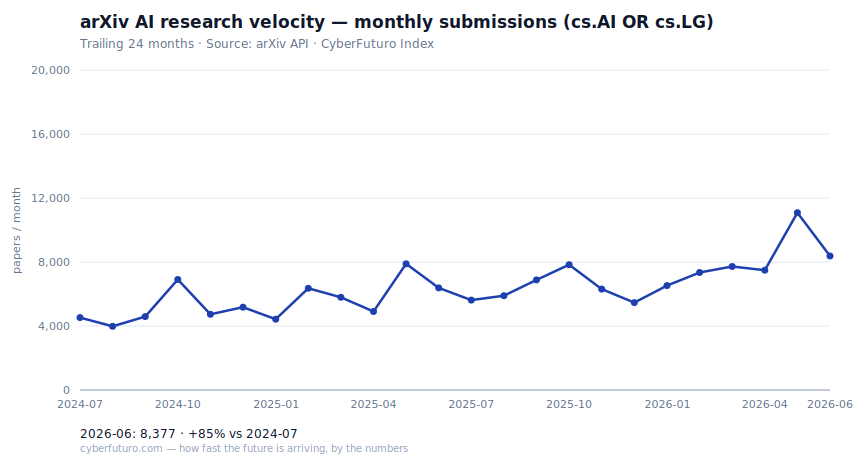

# CyberFuturo #01 — AI research velocity

*2026-04-11 · ~4-minute read · [Raw data](../../data/indices/arxiv-ai-velocity.csv) · [Methodology](../../src/indices/arxiv-ai-velocity/methodology.md)*

---

## The number

**7,406** — new AI/ML papers submitted to arXiv in **March 2026**.

That's the highest monthly output we've seen in the cs.AI + cs.LG categories since our 24-month tracking window began, and **+79% vs. the same window two years ago** (April 2024: 4,130).

---

## What moved

Three things the chart shows that the headline number doesn't:

**1. The YoY rate is ~28%, not 79%.** That two-year doubling is eye-catching, but most of it is compounding. Comparing trailing-12 to prior-12:
- Apr 2025 → Mar 2026: **6,529 papers/month average**
- Apr 2024 → Mar 2025: **5,119 papers/month average**
- **+27.5% YoY**

That's faster than global GDP, faster than cloud-compute spend, faster than almost any macro indicator — but well short of the "exponential" narrative some press cycles imply.

**2. Volatility is structural.** Look at 2024-08 (3,981) vs 2025-05 (7,886). That's nearly a 2× swing within a year. arXiv submissions are seasonal (conference deadlines for NeurIPS, ICML, ICLR push clusters into specific months) and uneven. Don't read individual months as trend shifts — they're noise against a rising signal.

**3. Q1 2026 is the strongest Q1 on record in this window.** Jan 6,502 / Feb 7,284 / Mar 7,406 averages **7,064 papers/month** — up **+27.9%** from Q1 2025 (5,524). The acceleration is holding, not decelerating.

---

## What this is *not*

This is one data point — arXiv submissions in two specific categories, counted by submission date. It does not measure paper quality, reproducibility, or whether the research matters. It's a raw velocity indicator, nothing more. Read it as: *how fast is the AI research surface area expanding?*

Anything beyond that — claims about capability scaling, model quality, or "AI is speeding up / slowing down" — is interpretation on top of the number, not the number itself.

---

## How this was built

Every index in CyberFuturo is deterministic: a documented query against a public API, run on a schedule, stored as CSV, rendered to SVG. No LLM generated the numbers. No forecasts. The methodology document lives next to the data — if the methodology changes, the change is logged and past values are reproducible.

Full source: [scripts/build_index_arxiv_ai.py](../../scripts/build_index_arxiv_ai.py) · [methodology](../../src/indices/arxiv-ai-velocity/methodology.md)

---

## Next

Over the next few issues I'm adding two more indices to CyberFuturo: **global compute capex** and **battery $/kWh**. The goal is simple — give you a small, rigorous set of numbers that tell you how fast the digital, compute, and energy foundations of the near future are actually being built.

If you want to follow along, subscribe below. If you spot a methodology problem, reply to this email — corrections go out in the next issue with a changelog entry.

*— CyberFuturo. How fast the future is arriving, by the numbers.*
